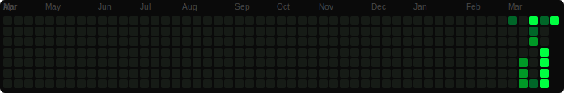

# LeetCode Solutions

**53** solved | **5** day streak | **53** this month

**17** Easy | **35** Medium | **1** Hard

---

| # | Title | Difficulty | Topic | Solution |
|---|-------|-----------|-------|----------|
| 1 | [Two Sum](https://leetcode.com/problems/two-sum/description/) | Easy | Array | [C++](solutions/0001-two-sum.cpp) |
| 1 | [Two Sum](https://leetcode.com/problems/two-sum/) | Easy | Array | [C++](solutions/0001-two-sum.cpp) |
| 3 | [Longest Substring Without Repeating Characters](https://leetcode.com/problems/longest-substring-without-repeating-characters/) | Medium | Hash Table | [C++](solutions/0003-longest-substring-without-repeating-characters.cpp) |
| 3 | [Longest Substring Without Repeating Characters](https://leetcode.com/problems/longest-substring-without-repeating-characters/) | Medium | Sliding Window | [C++](solutions/0003-longest-substring-without-repeating-characters.cpp) |
| 5 | [Longest Palindromic Substring](https://leetcode.com/problems/longest-palindromic-substring/) | Medium | Two Pointers | [C++](solutions/0005-longest-palindromic-substring.cpp) |
| 11 | [Container With Most Water](https://leetcode.com/problems/container-with-most-water/submissions/1961250520/) | Medium | Array | [C++](solutions/0011-container-with-most-water.cpp) |
| 11 | [Container With Most Water](https://leetcode.com/problems/container-with-most-water/) | Medium | Two Pointers | [C++](solutions/0011-container-with-most-water.cpp) |
| 15 | [3Sum](https://leetcode.com/problems/3sum/) | Medium | Array | [C++](solutions/0015-3sum.cpp) |
| 15 | [3Sum](https://leetcode.com/problems/3sum/) | Medium | Array | [C++](solutions/0015-3sum.cpp) |
| 15 | [3Sum](https://leetcode.com/problems/3sum/) | Medium | Two Pointers | [C++](solutions/0015-3sum.cpp) |
| 20 | [Valid Parentheses](https://leetcode.com/problems/valid-parentheses/) | Easy | String | [C++](solutions/0020-valid-parentheses.cpp) |
| 20 | [Valid Parentheses](https://leetcode.com/problems/valid-parentheses/) | Easy | Stack | [C++](solutions/0020-valid-parentheses.cpp) |
| 36 | [Valid Sudoku](https://leetcode.com/problems/valid-sudoku/description/) | Medium | Array | [C++](solutions/0036-valid-sudoku.cpp) |
| 42 | [Trapping Rain Water](https://leetcode.com/problems/trapping-rain-water/) | Hard | Two Pointers | [C++](solutions/0042-trapping-rain-water.cpp) |
| 49 | [Group Anagrams](https://leetcode.com/problems/group-anagrams/) | Medium | Array | [C++](solutions/0049-group-anagrams.cpp) |
| 56 | [Merge Intervals](https://leetcode.com/problems/merge-intervals/) | Medium | Array | [C++](solutions/0056-merge-intervals.cpp) |
| 98 | [Validate Binary Search Tree](https://leetcode.com/problems/validate-binary-search-tree/) | Medium | Tree | [C++](solutions/0098-validate-binary-search-tree.cpp) |
| 100 | [Same Tree](https://leetcode.com/problems/same-tree/) | Easy | Tree | [C++](solutions/0100-same-tree.cpp) |
| 102 | [Binary Tree Level Order Traversal](https://leetcode.com/problems/binary-tree-level-order-traversal/submissions/1961760344/) | Medium | Tree | [C++](solutions/0102-binary-tree-level-order-traversal.cpp) |
| 104 | [Maximum Depth of Binary Tree](https://leetcode.com/problems/maximum-depth-of-binary-tree/) | Easy | Tree | [C++](solutions/0104-maximum-depth-of-binary-tree.cpp) |
| 104 | [Maximum Depth of Binary Tree](https://leetcode.com/problems/maximum-depth-of-binary-tree/) | Easy | Tree | [C++](solutions/0104-maximum-depth-of-binary-tree.cpp) |
| 121 | [Best Time to Buy and Sell Stock](https://leetcode.com/problems/best-time-to-buy-and-sell-stock/) | Easy | Sliding Window | [C++](solutions/0121-best-time-to-buy-and-sell-stock.cpp) |
| 125 | [Valid Palindrome](https://leetcode.com/problems/valid-palindrome/) | Easy | Two Pointers | [C++](solutions/0125-valid-palindrome.cpp) |
| 128 | [Longest Consecutive Sequence](https://leetcode.com/problems/longest-consecutive-sequence/) | Medium | Hash Table | [C++](solutions/0128-longest-consecutive-sequence.cpp) |
| 146 | [LRU Cache](https://leetcode.com/problems/lru-cache/) | Medium | Hash Table | [C++](solutions/0146-lru-cache.cpp) |
| 146 | [LRU Cache](https://leetcode.com/problems/lru-cache/) | Medium | Hash Table | [C++](solutions/0146-lru-cache.cpp) |
| 146 | [LRU Cache](https://leetcode.com/problems/lru-cache/) | Medium | Hash Table | [C++](solutions/0146-lru-cache.cpp) |
| 155 | [Min Stack](https://leetcode.com/problems/min-stack/) | Medium | Stack | [C++](solutions/0155-min-stack.cpp) |
| 167 | [Two Sum II - Input Array Is Sorted](https://leetcode.com/problems/two-sum-ii-input-array-is-sorted/) | Medium | Array | [C++](solutions/0167-two-sum-ii-input-array-is-sorted.cpp) |
| 198 | [House Robber](https://leetcode.com/problems/house-robber/) | Medium | Dynamic Programming | [C++](solutions/0198-house-robber.cpp) |
| 200 | [Number of Islands](https://leetcode.com/problems/number-of-islands/description/) | Medium | Array | [C++](solutions/0200-number-of-islands.cpp) |
| 206 | [Reverse Linked List](https://leetcode.com/problems/reverse-linked-list/) | Easy | Linked List | [C++](solutions/0206-reverse-linked-list.cpp) |
| 207 | [Course Schedule](https://leetcode.com/problems/course-schedule/) | Medium | Depth-First Search | [C++](solutions/0207-course-schedule.cpp) |
| 213 | [House Robber II](https://leetcode.com/problems/house-robber-ii/) | Medium | Array | [C++](solutions/0213-house-robber-ii.cpp) |
| 217 | [Contains Duplicate](https://leetcode.com/problems/contains-duplicate/) | Easy | Array | [C++](solutions/0217-contains-duplicate.cpp) |
| 226 | [Invert Binary Tree](https://leetcode.com/problems/invert-binary-tree/description/) | Easy | Tree | [C++](solutions/0226-invert-binary-tree.cpp) |
| 238 | [Product of Array Except Self](https://leetcode.com/problems/product-of-array-except-self/submissions/1959408341/) | Medium | Array | [C++](solutions/0238-product-of-array-except-self.cpp) |
| 238 | [Product of Array Except Self](https://leetcode.com/problems/product-of-array-except-self) | Medium | Array | [C++](solutions/0238-product-of-array-except-self.cpp) |
| 242 | [Valid Anagram](leetcode.com/problems/valid-anagram) | Easy | Hash Table | [C++](solutions/0242-valid-anagram.cpp) |
| 242 | [Valid Anagram](https://leetcode.com/problems/valid-anagram/) | Easy | Hash Table | [C++](solutions/0242-valid-anagram.cpp) |
| 271 | [Encode and Decode Strings](https://leetcode.com/problems/encode-and-decode-strings/) | Medium | Array | [C++](solutions/0271-encode-and-decode-strings.cpp) |
| 322 | [Coin Change](https://leetcode.com/problems/coin-change/description/?envType=problem-list-v2&envId=voxa048v) | Medium | Array | [C++](solutions/0322-coin-change.cpp) |
| 347 | [Top K Frequent Elements](https://leetcode.com/problems/top-k-frequent-elements/) | Medium | Array | [C++](solutions/0347-top-k-frequent-elements.cpp) |
| 424 | [Longest Repeating Character Replacement](https://leetcode.com/problems/longest-repeating-character-replacement/) | Medium | Sliding Window | [C++](solutions/0424-longest-repeating-character-replacement.cpp) |
| 543 | [Diameter of Binary Tree](https://leetcode.com/problems/diameter-of-binary-tree/) | Easy | Tree | [C++](solutions/0543-diameter-of-binary-tree.cpp) |
| 572 | [Subtree of Another Tree](https://leetcode.com/problems/subtree-of-another-tree/) | Easy | Tree | [C++](solutions/0572-subtree-of-another-tree.cpp) |
| 622 | [Design Circular Queue](https://leetcode.com/problems/design-circular-queue/) | Medium | Array | [C++](solutions/0622-design-circular-queue.cpp) |
| 647 | [Palindromic Substrings](https://leetcode.com/problems/palindromic-substrings) | Medium | Two Pointers | [C++](solutions/0647-palindromic-substrings.cpp) |
| 733 | [Flood Fill](https://leetcode.com/problems/flood-fill/submissions/1960460252/) | Easy | Array | [C++](solutions/0733-flood-fill.cpp) |
| 739 | [Daily Temperatures](https://leetcode.com/problems/daily-temperatures/) | Medium | Array | [C++](solutions/0739-daily-temperatures.cpp) |
| 739 | [Daily Temperatures](https://leetcode.com/problems/daily-temperatures/) | Medium | Array | [C++](solutions/0739-daily-temperatures.cpp) |
| 994 | [Rotting Oranges](https://leetcode.com/problems/rotting-oranges/submissions/1961801783/) | Medium | Array | [C++](solutions/0994-rotting-oranges.cpp) |
| 2771 | [Longest Non-decreasing Subarray From Two Arrays](https://leetcode.com/problems/longest-non-decreasing-subarray-from-two-arrays/) | Medium | Dynamic Programming | [C++](solutions/2771-longest-non-decreasing-subarray-from-two-arrays.cpp) |
